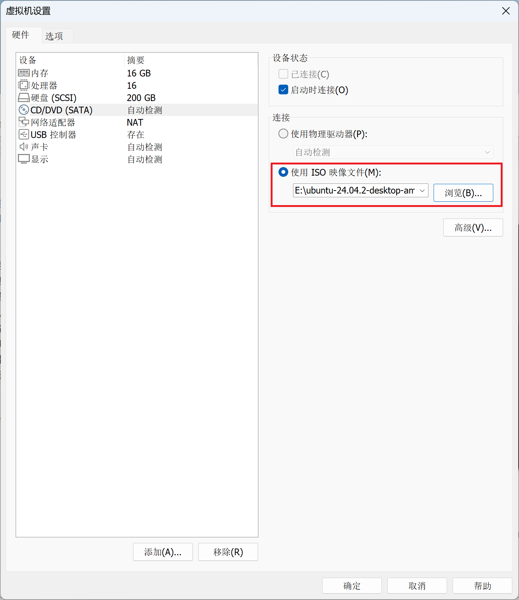
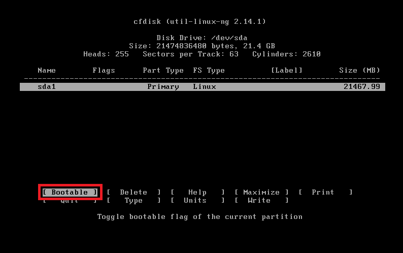
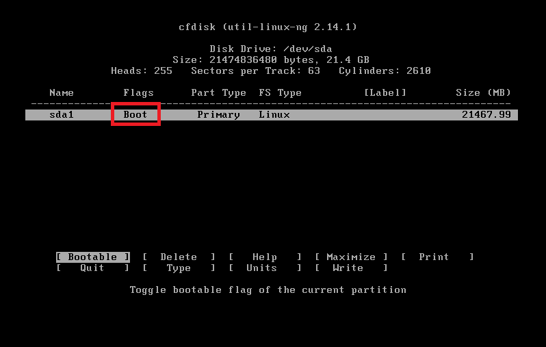
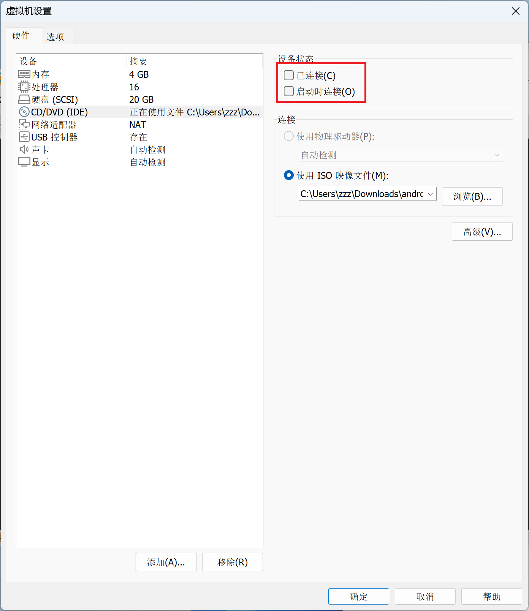
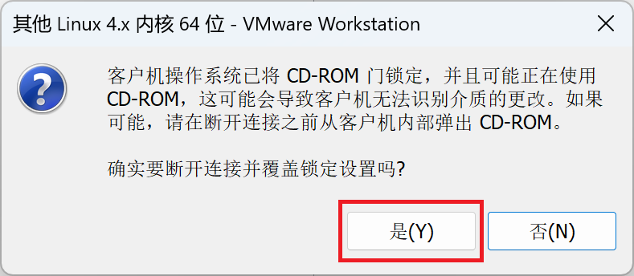

# 目录

- [自述文件](../README.md)
- [Android-X86_64-4.4-r5](../Android-X86_64-4.4-r5/Android-X86_64-4.4-r5.md)
- [Android-X86_64-9.0-r2](../Android-X86_64-9.0-r2/Android-X86_64-9.0-r2.md)
- [macOS Sequoia 15.5(24F74)](../macOS%20Sequoia%2015.5(24F74)/macOS%20Sequoia%2015.5(24F74).md)
- [Ubuntu Desktop 24.04.2 LTS](../Ubuntu%20Desktop%2024.04.2%20LTS/Ubuntu%20Desktop%2024.04.2%20LTS.md)
- [Kali Linux 2026.1](../Kali%20Linux%202026.1/Kali%20Linux%202026.1.md)
- [Windows 10 专业工作站版](../Windows%2010%20专业工作站版/Windows%2010%20专业工作站版.md)
- [Windows 11 专业工作站版](../Windows%2011%20专业工作站版/Windows%2011%20专业工作站版.md)
- [Windows 物理机转 VMware 虚拟机](../Windows%20物理机转%20VMware%20虚拟机/Windows%20物理机转%20VMware%20虚拟机.md)


# 在 VMware 安装 Android-X86_64-9.0-r2

#### 自定义


####  下一步


####  稍后安装操作系统(S)


####  FreeBSD 11


#### 自定义虚拟机名称位置


#### 根据电脑配置选择


#### 根据电脑配置选择


#### 使用网络地址转换(NAT)(E)


#### LSI Logic(L)


#### IDE(I)


#### 创建新虚拟磁盘(V)


#### 根据镜像系统大小选择


#### 下一步


####  完成


####  使用ISO映像文件(M)
`android-x86_64-9.0-r2.iso`




#  开机界面

#### Installation - Install Android-x86 to harddisk 
`安装 - 将Android-x86安装到硬盘`


#### Create/Modify partitions
`创建/修改分区`


#### NO
`你想用GPT吗？`


#### New`新建分区`
Create new partition from free space`从空闲空间创建新分区`


#### Primary`主要分区`
Create a new primary partition`创建一个新的主分区`


#### 确认
Size (in MB): 53686.40`大小（以兆字节为单位）：53686.40`


#### Bootable`可引导的`
Toggle bootable flag of the current partition`切换当前分区的可引导标记状态`





#### Write`写入`
Write partition table to disk (this might destroy data) `将分区表写入磁盘（这可能会破坏数据）`


#### 输入`yes`
Are you sure you want to write the partition table to disk? (yes or no) `您确定要将分区表写入磁盘吗？（是或否）`

Warning!! This may destroy data on your disk! `警告！！这可能会破坏磁盘上的数据！`


#### Quit`退出`
Quit program without writing partition table`不写入分区表退出程序`


#### sda1
Please select a partition to install Android - x86 `请选择要安装Android - x86的分区`


#### ext4
Please select a filesystem to format sda1: `请选择要格式化sda1的文件系统：`


#### YES
You chose to format sda to ext4 `您选择了将sda格式化为ext4`

All data in that partition will LOSE `该分区中的所有数据都将丢失`

Are you sure to format the partition sda? `您确定要格式化sda分区吗？`


Formatting partition sda1... `正在格式化分区sda1...`


#### YES
Do you want to install boot loader GRUB? `您想安装引导加载器GRUB吗？`


#### YES
Do you want to install /system directory as read-write?`你想要将 /system 目录安装为可读写（read-write ）模式吗？`

Making /system be read - write is easier for debugging, but it needs more disk space and longer installation time.`将 /system 设为可读写（read - write ）模式便于调试，但这需要更多磁盘空间，且安装时间会更长`


Expect to write 2254116 KB...`预计写入 2254116 千字节（KB）的数据……`


#### 断开 CD/DVD 连接状态


#### 是(Y)


#### Reboot
Android - x86 is installed successfully.`Android - x86 已成功安装`

Run Android - x86`运行 Android - x86`

Reboot`重启`


Rebooting...`正在重启……`


# `Android-x86 9.0-r2 (Debug mode)`


####  重新挂载 /mnt 目录所在的文件系统，并将其设置为读写（rw）模式

```bash
mount -o remount,rw /mnt
```


####  修改 `/mnt/grub/menu.lst`

```bash
vi /mnt/grub/menu.lst
```


####  按`i`键 当左下角出现`I`进入编辑模式
在`quiet`后面加入

```bash
nomodeset
```


####  按`esc`键 当左下角`I`消失退出编辑模式

```bash
：x!
```


# 启动 Android-x86 9.0-r2


