## 目录

- [自述文件](/README.md)
- [Android-X86_64-4.4-r5](/Android-X86_64-4.4-r5/Android-X86_64-4.4-r5.md)
- [Android-X86_64-9.0-r2](/Android-X86_64-9.0-r2/Android-X86_64-9.0-r2.md)
- [macOS Sequoia 15.5(24F74)](/macOS%20Sequoia%2015.5(24F74)/macOS%20Sequoia%2015.5(24F74).md)
- [Ubuntu Desktop 24.04.2 LTS](/Ubuntu%20Desktop%2024.04.2%20LTS/Ubuntu%20Desktop%2024.04.2%20LTS.md)
- [Windows 10 专业工作站版](/Windows%2010%20专业工作站版/Windows%2010%20专业工作站版.md)
- [Windows 11 专业工作站版](/Windows%2011%20专业工作站版/Windows%2011%20专业工作站版.md)
- [Windows 物理机转 VMware 虚拟机](/Windows%20物理机转%20VMware%20虚拟机/Windows%20物理机转%20VMware%20虚拟机.md)

## android-x86 下载

 - [android-x86 Files](https://sourceforge.net/projects/android-x86/files/)


## 创建 VMware 虚拟机
## android-x86 下载

 - [android-x86 Files](https://sourceforge.net/projects/android-x86/files/)


## 参考


- [【装系统】Android-x86 4.4安装到VMware的教程](https://www.0xaa55.com/thread-1730-1-1.html)

##  下载

- [下载 Ubuntu 桌面](https://ubuntu.com/download/desktop)
####  

vmtool 下载地址
https://packages-prod.broadcom.com/tools/frozen/linux/linux.iso

## 参考

- [黑苹果社区 - 专注于黑苹果安装系统教程驱动软件](https://osx.cx/)
- [黑苹果屋 - 黑苹果屋—Hackintosh-黑苹果单双系统安装全套完整教程资源](https://imacos.top/category/hpgw/xtgx/iso/)
- [黑苹果星球-分享Mac的精彩世界](https://heipg.cn/)

## 补充

- [提升Ubuntu性能的15个最佳技巧](https://cn.linux-console.net/?p=36276)
- [每个初学者都应该知道的15个基础Linux问题](https://cn.linux-console.net/?p=36280)
## 平台

- [如何制作适用于VMware Fusion安装的macOS Catalina CDR系统镜像？](https://heipg.cn/tutorial/macos-catalina-cdr.html)
## 1111

- [在 Windows 下使用 VMware Workstation 安装 macOS 的详细教程](https://heipg.cn/tutorial/install-macos-by-using-vmware-in-windows.html)

- [macOS虚拟机安装全过程（VMware）](https://blog.csdn.net/raspi_fans/article/details/122908420)


# 镜像
  
- [macOS Monterey 12.6(21G115)正式版 虚拟机ISO格式](https://heipg.cn/macos/macos-monterey-12-6-21g115-iso.html)
- [macOS Sequoia 15.5(24F74) 正式版 虚拟机ISO格式](https://heipg.cn/macos/macos-sequoia-15-5-24f74-iso.html)

## 参考


无法下载APP

破解macos限制

虚拟化引擎，虚拟化Intel VT-x/EPT或AMD-V/RVI(V)


unlocker会帮你下载一个最新版的darwin.iso
VMware Tools ===== darwin.iso 


图片1 选择语言为中文，点击“磁盘工具”；
图片2 左侧栏选择VMware开头的那项，点击上方的“抹掉”；
图片3 名称自己选，下面两个默认；
图片4


打开macOS虚拟机等待进度条结束

点击“磁盘工具”，选择第一个磁盘，点击上方“抹掉”，设置名称，格式方案默认。
点击安装macOS系统，等待系统安装完成
关机，添加硬件CD/DVD，选择ISO镜像文件darwin.iso 
开机，安装VMware Tools


安装VMware Tools


常见问题：
黑屏 / 卡进度条：减少 CPU 核心数至 2 核，关闭 3D 加速。
VMware Tools 安装失败：手动挂载 darwin.iso，运行 ./VMwareTools-*.pl 脚本。

</a>

- [VMware Workstation安装安卓Android-X86 最新版](https://www.cnblogs.com/Summer6/p/13696468.html)

截至2025年6月24日，在VMware中可尝试安装的 **Android最新可用版本，主要基于Android - x86项目，当前适配到类似 Android 9.0、10 等版本的 x86 移植版** ，原因和关键说明如下：  

### 一、核心限制：Android 官方无“PC 原生镜像”  
Android 官方系统（如 Android 16）**仅面向手机/平板等移动设备** ，没有直接适配 x86 架构 PC 的安装包，也不支持 VMware 直接安装。  

若想在 VMware 跑 Android，需依赖 **Android - x86 项目**（把 Android 移植到 x86 架构的社区项目 ），其提供的镜像，是 VMware 安装 Android 系统的唯一可行方案。  


### 二、Android - x86 最新适配情况  
目前 Android - x86 项目对高版本 Android（如 11+ ）的适配 **仍有兼容性问题**（如驱动、硬件支持不完善 ），实际可稳定安装使用的，多是 **Android 9.0、10 左右的 x86 移植版** ，例如：  
- **Android - x86 9.0**：社区相对完善的版本，支持 VMware 安装，适配基础硬件（网卡、显卡模拟 ），可运行大部分 App。  
- **Android - x86 10**：部分镜像可尝试，但对 VMware 环境要求更高，可能出现启动卡 Logo、硬件无法驱动等问题。  


### 三、安装建议（以 Android - x86 9.0 为例）  
1. **下载镜像**：  
   去 [Android - x86 官网](https://www.android-x86.org/) 或 OSDN 平台，找 **android - x86 - 9.0 - r2.iso**（或带 `k49` 后缀的稳定版 ）。  

2. **VMware 配置**：  
   - 新建虚拟机，选 **“典型”安装**，加载下载的 `.iso` 镜像。  
   - 客户机操作系统选 **“Linux”** → 版本选 **“其他 Linux 4.x 内核 64 位”** 。  
   - 分配内存 ≥2GB、CPU ≥2 核、磁盘 ≥12GB 。  

3. **安装关键步骤**：  
   - 启动虚拟机后，选 **“Installation - Install Android - x86 to harddisk”** 。  
   - 磁盘分区选 **“Create/Modify partitions”** ，手动建主分区并标记为 `Bootable` ，格式选 `ext4` 。  
   - 安装 GRUB 引导、设置系统可读写，重启后若卡 Logo，需进 Debug 模式添加 `nomodeset` 参数（修复显卡兼容 ）。  


### 四、更高版本尝试（风险提示）  
若想测试 Android 11+ 版本，可搜 **“Android - x86 11/12 镜像”** ，但需注意：  
- 可能因 VMware 模拟环境、驱动适配问题，出现无法启动、硬件（如网络、声卡 ）无法使用等情况。  
- 更适合技术调试，不建议日常使用。  


总结：**VMware 安装 Android，实际依赖 Android - x86 项目，当前稳定可用的“最新版本”是 Android 9.0/10 左右的移植版** ；若追求官方高版本（如 Android 16 ），需等 Android - x86 社区进一步适配，或改用 Android 官方模拟器（Android Studio 自带，但非 VMware 环境 ）。


参考只提供链接不放png但保留png


验证 .png" width="  对应的图片是否正确


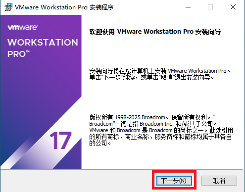
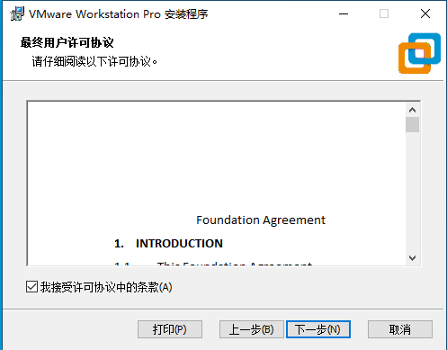
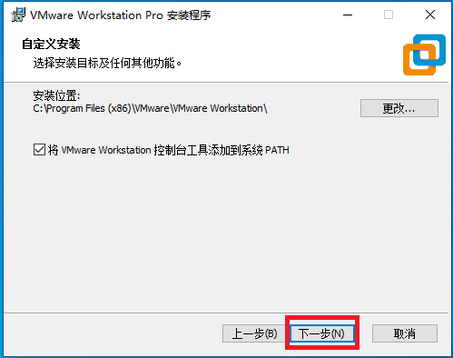
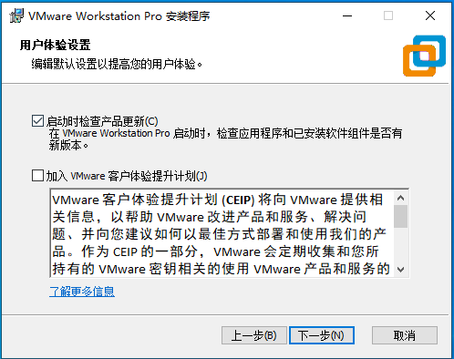
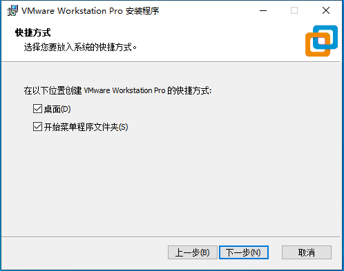
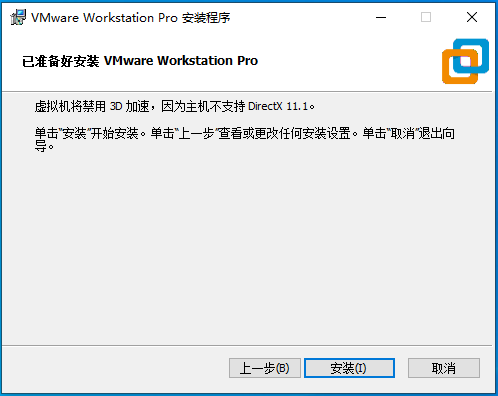
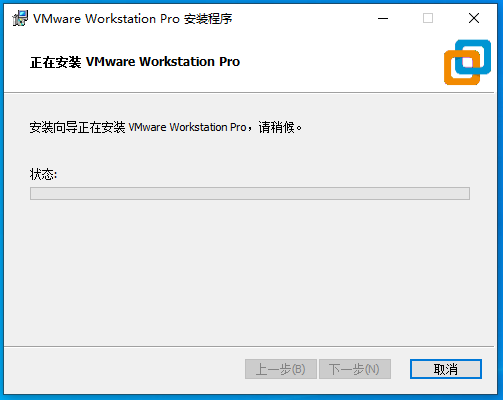
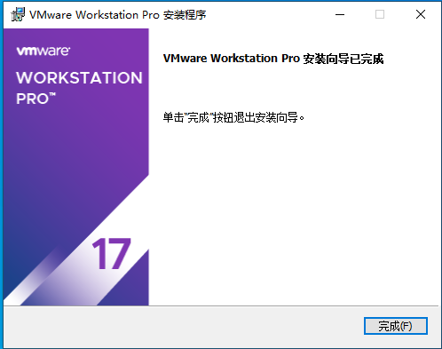


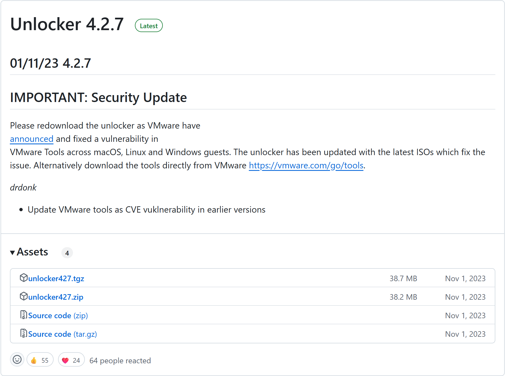
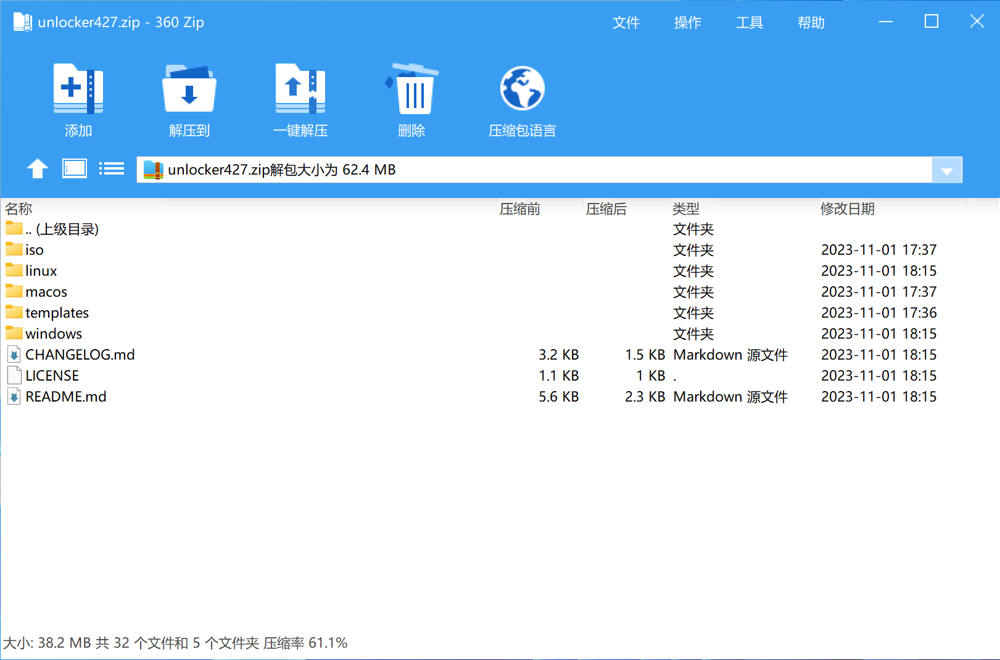
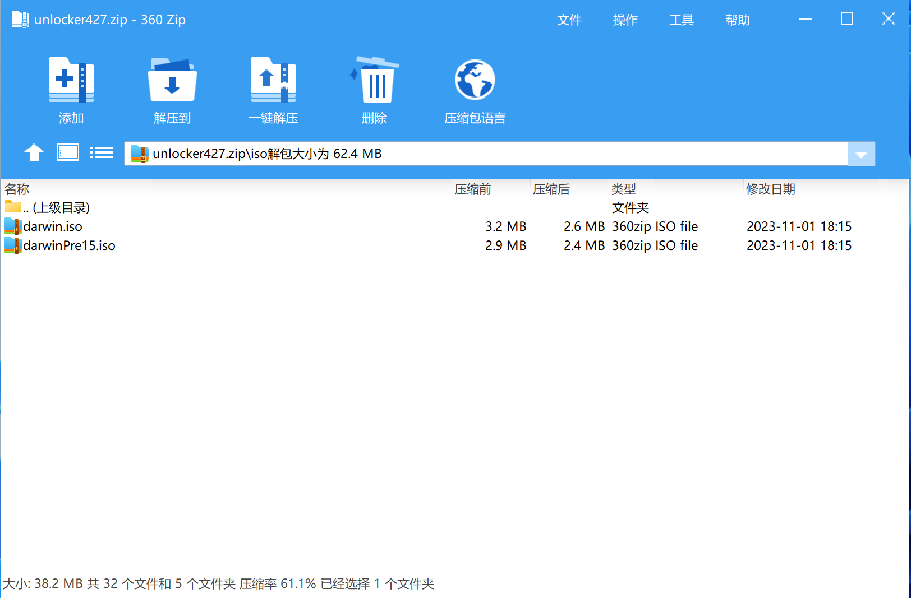
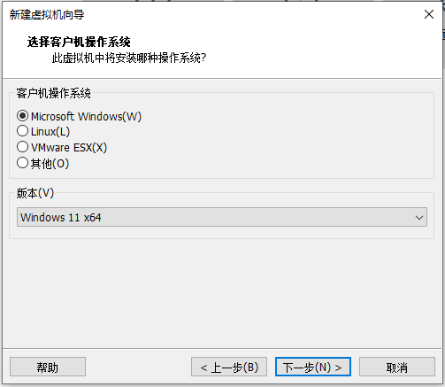
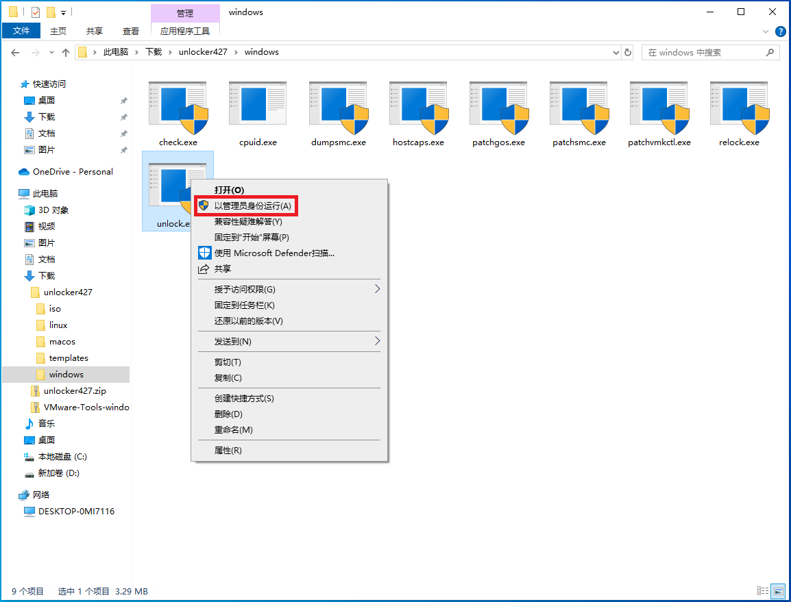
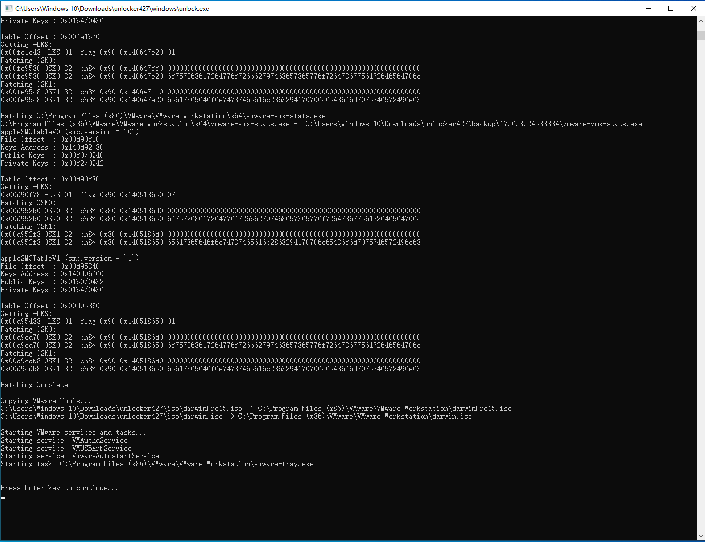
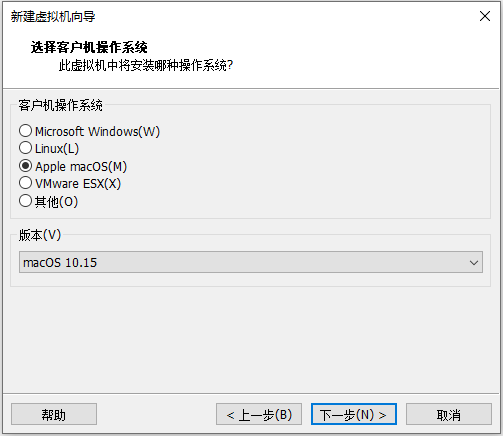


- [Python 3.8.10](https://www.python.org/downloads/release/python-3810/)
- [Python 3.9.13](https://www.python.org/downloads/release/python-3913/)
- [Python 3.10.11](https://www.python.org/downloads/release/python-31011/)
- [Python 3.11.9 ](https://www.python.org/downloads/release/python-3119/)
- [Python 3.12.10](https://www.python.org/downloads/release/python-31210/)
- [Python 3.13.5](https://www.python.org/downloads/release/python-3135/)


HiBitUninstaller
PA_Green
HEU_KMS_Activator_v50.0.0.exe
dControl
WeChatSetup.exe
DiskGenius
idman642build27.exe

 - [优启通EasyU 3.7.2023.1206_小鱼儿yr定制版](https://www.yrxitong.com/h-nd-764.html)
```bash
yrxitong.com
```


- [360 Zip](https://www.360totalsecurity.com/zh-cn/360zip/)
- [Google Chrome](https://www.google.com/chrome/)
- [VS Code](https://code.visualstudio.com/)
- [PyCharm](https://www.jetbrains.com/zh-cn/pycharm/download/?section=windows)
- [Notepad++](https://notepad-plus-plus.org/downloads/)
- [软碟通_UltraISO 9.7.6.3860](https://www.yrxitong.com/h-nd-377.html)


- [下载 android-x86 文件](https://sourceforge.net/projects/android-x86/files/)

- [VMware macOS 解锁](https://github.com/DrDonk/unlocker/releases)

- [免费下载](https://support.broadcom.com/group/ecx/free-downloads)


- [《使用 VMware Workstation Pro》](https://techdocs.broadcom.com/cn/zh-cn/vmware-cis/desktop-hypervisors/workstation-pro/17-0/using-vmware-workstation-pro.html)


- [VMware 工作站专业版](https://support.broadcom.com/group/ecx/productdownloads?subfamily=VMware%20Workstation%20Pro&freeDownloads=true)


- [VMware Tools](https://support.broadcom.com/group/ecx/productdownloads?subfamily=VMware%20Tools&freeDownloads=true)

```bash
1135604098@qq.com
```
```bash
Password@123
```

```bash
@echo off
chcp 65001 > nul
(for /f "tokens=*" %%a in ('DIR /B *.png') do @echo ^) > ..\png.md
```


主要负责下载安装 介绍NTA   VMware Tools

解决读取本地文件夹的问题，不需要请求GitHub通过路径解决图片加载问题


仅做系统安装和更新，不进行任何优化和安装，在系统里面提供VPN 微信 QQ 等软件安装包，确保离线，网络限制/无需在下载安装


下载内容


macOSulok
macos.ios
关闭安全中心。。。
激活版本
https://www.sordum.org/


# 下载

发行版文件

unlock
Tools


UEFI 引导文件制作 优PE
linux VM Tools
macOS VM Tools
macOS unlock   release-python-embedded.zip

备注非特定功能，不要修改任何参数，例如USB会导致mac无法连接键盘鼠标
处理器，4*4 保证处理器数量和内核数量都为偶数，且总数不超过自身上班处理器数量
共享文件夹
vm tools 更新策略
虚拟化引擎，虚拟化Intel VT-x/EPT或AMD-V/RVI(V) 有什么意义
网络配置 NTA 网桥


显示器3D加速
VMware  Tools 自动更新
高级，固件类型 UEFI
引导类型

客户机隔离，启用拖放，启用复制粘贴

镜像下载链接 Linux Windows mac 安卓

常见故障排除
问题	可能原因	解决方案
虚拟机无法联网	NAT 服务未启动	重启 VMware 服务：net start VMware NAT Service
鼠标键盘无响应	USB 兼容性问题	在.vmx添加：usb.generic.allowHID = "TRUE"
虚拟机黑屏	显卡驱动冲突	禁用 3D 加速或更新 VMware Tools 至最新版
磁盘空间不足	虚拟磁盘膨胀	使用vmware-vdiskmanager -k "磁盘.vmdk"进行磁盘压缩

处理器	2-4 核（偶数）	总数不超过物理 CPU 核心数，如 8 核主机可设 4×2
内存	2GB 起（根据系统调整）	macOS 至少 4GB，Linux 桌面版 2GB，服务器版 1GB
硬盘	20GB+（推荐 SSD）	选择 “将虚拟磁盘存储为单个文件” 提升性能
显卡	启用 3D 加速	勾选 “加速 3D 图形”，显存设为 512MB+（用于图形设计）

NAT	共享主机网络（默认）	DHCP 自动分配	虚拟机可访问互联网，主机可访问虚拟机
桥接	模拟物理网卡	与主机同网段（需手动配置）	虚拟机与局域网设备直接通信
仅主机	隔离测试环境	仅主机可访问虚拟机	禁止虚拟机访问外网

示例：桥接模式配置：
虚拟机设置 > 网络适配器 > 桥接模式，选择主机物理网卡（如 “以太网”）。
客户机系统中手动设置 IP 为与主机同网段（如主机 IP 192.168.1.100，虚拟机设 192.168.1.101）。


https://support.broadcom.com/group/ecx/productdownloads?subfamily=VMware%20Tools&freeDownloads=true


Microsoft Windows [版本 10.0.19045.5854]
(c) Microsoft Corporation。保留所有权利。

C:\Users\Windows 10\Downloads\VMware-Tools-windows-13.0.0.0.24696409-24696475\vmtools>dir /b
buildNumber.txt
isoimages_manifest.txt
isoimages_manifest.txt.sig
version.txt
windows.iso
windows.iso.sha
windows.iso.sig
windows_avr_manifest.txt
windows_avr_manifest.txt.sig

----------------------------------------windows.iso

--------------------------------------------------------------------------------------------------

https://github.com/DrDonk/unlocker/releases

Microsoft Windows [版本 10.0.26100.4061]
(c) Microsoft Corporation。保留所有权利。

C:\Users\zzz\Downloads\unlocker427\iso>DIR /B
darwin.iso
darwinPre15.iso

----------------------------------------darwin.iso


