# 目录

- [自述文件](../README.md)
- [Android-X86_64-4.4-r5](../Android-X86_64-4.4-r5/Android-X86_64-4.4-r5.md)
- [Android-X86_64-9.0-r2](../Android-X86_64-9.0-r2/Android-X86_64-9.0-r2.md)
- [macOS Sequoia 15.5(24F74)](../macOS%20Sequoia%2015.5(24F74)/macOS%20Sequoia%2015.5(24F74).md)
- [Ubuntu Desktop 24.04.2 LTS](../Ubuntu%20Desktop%2024.04.2%20LTS/Ubuntu%20Desktop%2024.04.2%20LTS.md)
- [Windows 10 专业工作站版](../Windows%2010%20专业工作站版/Windows%2010%20专业工作站版.md)
- [Windows 11 专业工作站版](../Windows%2011%20专业工作站版/Windows%2011%20专业工作站版.md)
- [Windows 物理机转 VMware 虚拟机](../Windows%20物理机转%20VMware%20虚拟机/Windows%20物理机转%20VMware%20虚拟机.md)

# 在 VMware 安装 macOS Sequoia 15.5(24F74)

#### 自定义
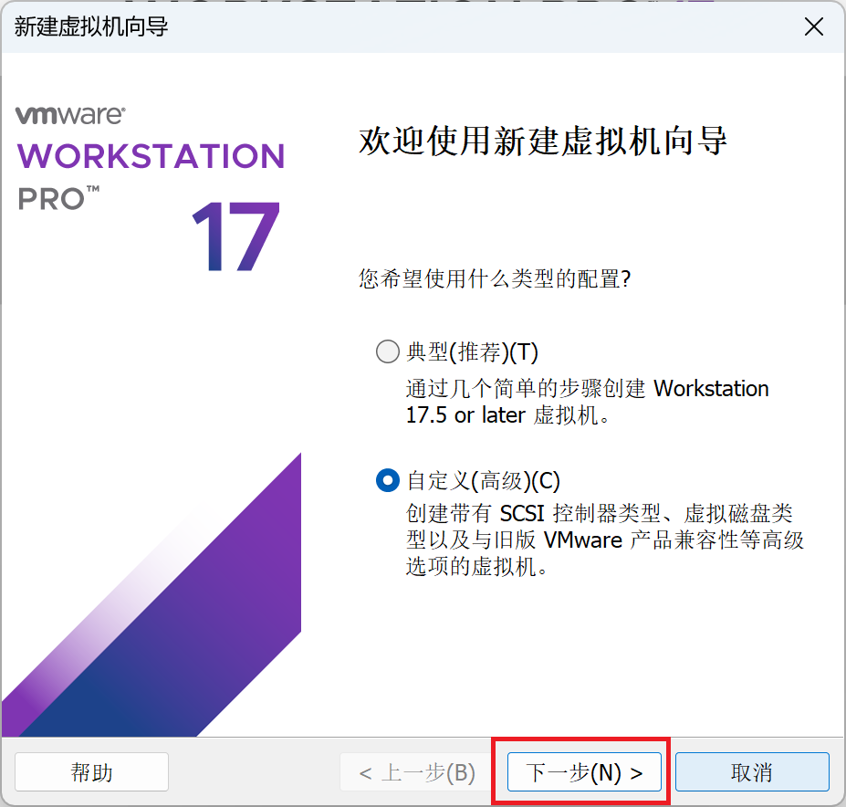

#### 下一步
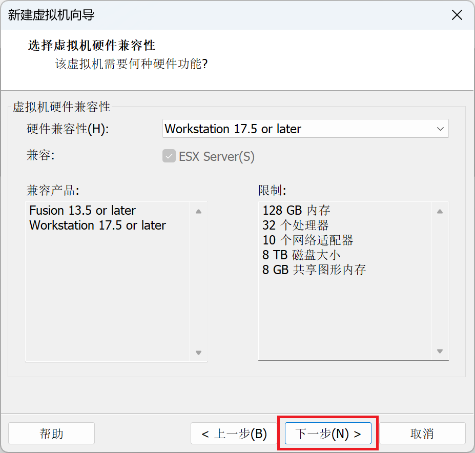

#### 稍后安装操作系统(S)


#### Apple macOS(M)


#### 自定义虚拟机名称位置


#### 根据电脑配置选择
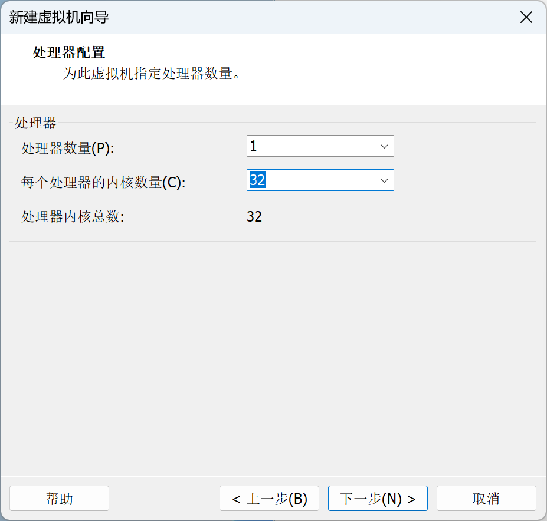

#### 根据电脑配置选择
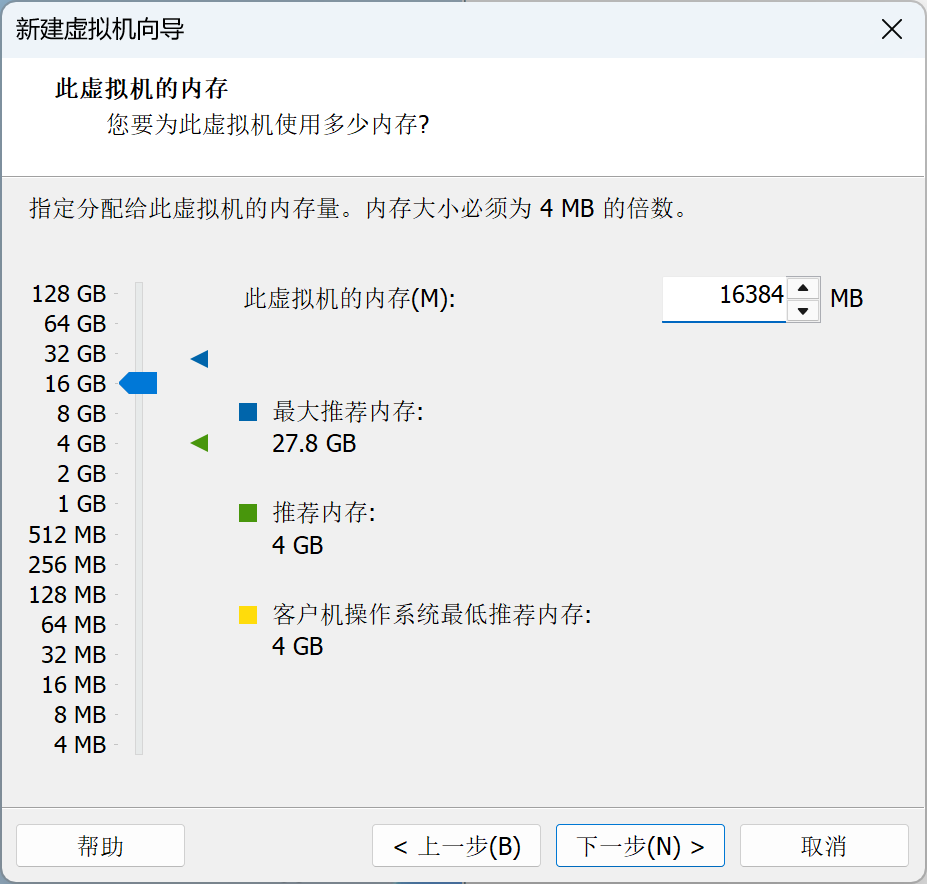

#### 使用网络地址转换(NAT)(E)


#### LSI Logic(L)


#### SATA(A)


#### 创建新虚拟磁盘(V)


#### 根据镜像系统大小选择 `将虚拟磁盘存储为单个文件(O)`


#### 下一步


#### 完成
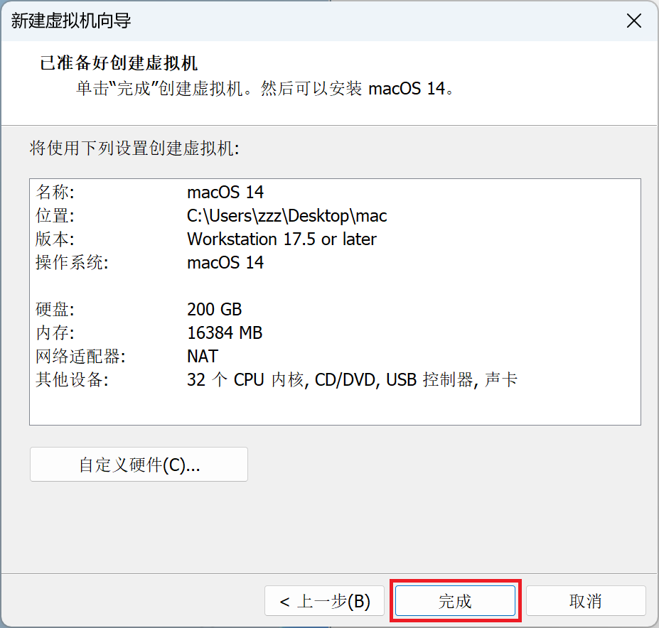

#### 使用ISO映像文件(M)
`[HeiPG.cn]Install_macOS_Sequoia_15.5(24F74)_VM.iso`

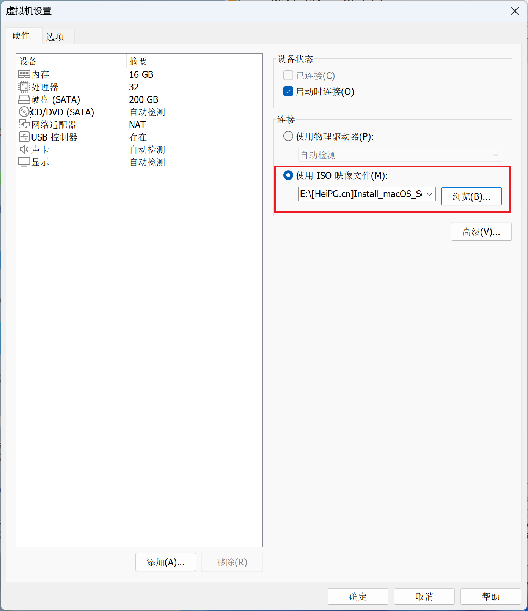


## 修改 VMware 配置文件

#### 记事本打开 `.vmx` 文件
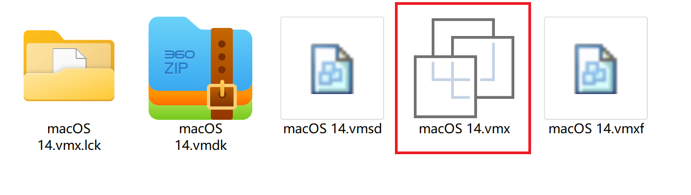

#### `macOS 14.vmx` 内容如下

```bash
.encoding = "GBK"
config.version = "8"
virtualHW.version = "21"
pciBridge0.present = "TRUE"
pciBridge4.present = "TRUE"
pciBridge4.virtualDev = "pcieRootPort"
pciBridge4.functions = "8"
pciBridge5.present = "TRUE"
pciBridge5.virtualDev = "pcieRootPort"
pciBridge5.functions = "8"
pciBridge6.present = "TRUE"
pciBridge6.virtualDev = "pcieRootPort"
pciBridge6.functions = "8"
pciBridge7.present = "TRUE"
pciBridge7.virtualDev = "pcieRootPort"
pciBridge7.functions = "8"
vmci0.present = "TRUE"
hpet0.present = "TRUE"
nvram = "macOS 14.nvram"
virtualHW.productCompatibility = "hosted"
powerType.powerOff = "soft"
powerType.powerOn = "soft"
powerType.suspend = "soft"
powerType.reset = "soft"
displayName = "macOS 14"
smc.present = "TRUE"
smbios.restrictSerialCharset = "TRUE"
firmware = "efi"
guestOS = "darwin23-64"
board-id.reflectHost = "TRUE"
ich7m.present = "TRUE"
tools.syncTime = "FALSE"
sound.autoDetect = "TRUE"
sound.virtualDev = "hdaudio"
sound.fileName = "-1"
sound.present = "TRUE"
numvcpus = "32"
cpuid.coresPerSocket = "32"
memsize = "16384"
sata0.present = "TRUE"
sata0:0.fileName = "macOS 14.vmdk"
sata0:0.present = "TRUE"
sata0:1.deviceType = "cdrom-image"
sata0:1.fileName = "E:\[HeiPG.cn]Install_macOS_Sequoia_15.5(24F74)_VM.iso"
sata0:1.present = "TRUE"
usb.present = "TRUE"
ehci.present = "TRUE"
usb_xhci.present = "TRUE"
ethernet0.connectionType = "nat"
ethernet0.addressType = "generated"
ethernet0.virtualDev = "vmxnet3"
ethernet0.present = "TRUE"
extendedConfigFile = "macOS 14.vmxf"
floppy0.present = "FALSE"
```

### **AMD 处理器** [2021款 小新 Pro 16 锐龙版](https://item.lenovo.com.cn/product/1013857.html)

##### 方案1：在末尾加入的内容

```bash
smc.version = "0"
cpuid.0.eax = "0000:0000:0000:0000:0000:0000:0000:1011"
cpuid.0.ebx = "0111:0101:0110:1110:0110:0101:0100:0111"
cpuid.0.ecx = "0110:1100:0110:0101:0111:0100:0110:1110"
cpuid.0.edx = "0100:1001:0110:0101:0110:1110:0110:1001"
cpuid.1.eax = "0000:0000:0000:0001:0000:0110:0111:0001"
cpuid.1.ebx = "0000:0010:0000:0001:0000:1000:0000:0000"
cpuid.1.ecx = "1000:0010:1001:1000:0010:0010:0000:0011"
cpuid.1.edx = "0000:0111:1000:1011:1111:1011:1111:1111"
```

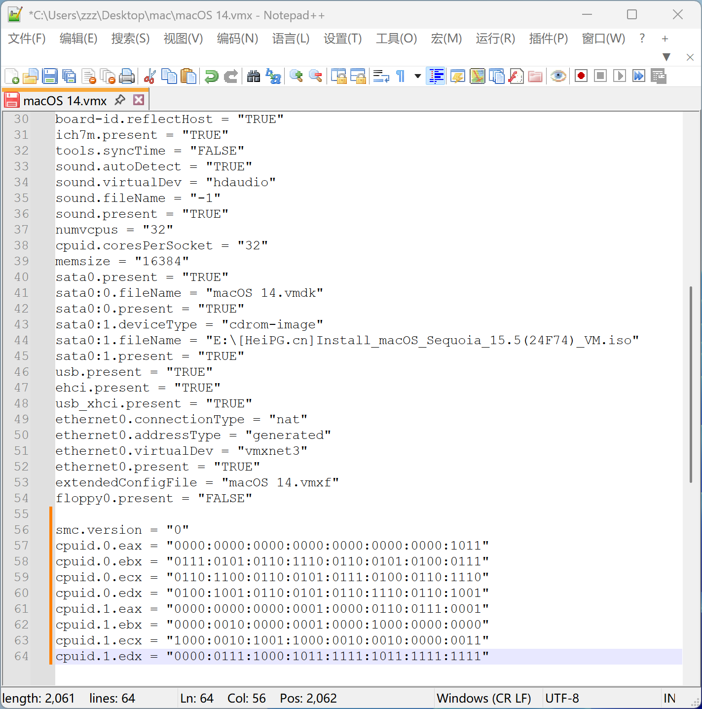

### **Intel 处理器** [ThinkBook 16p 2024 英特尔酷睿i9](https://tk.lenovo.com.cn/product/1036306.html)

##### 方案1：在末尾加入的内容

```bash
smc.version = "0"
```

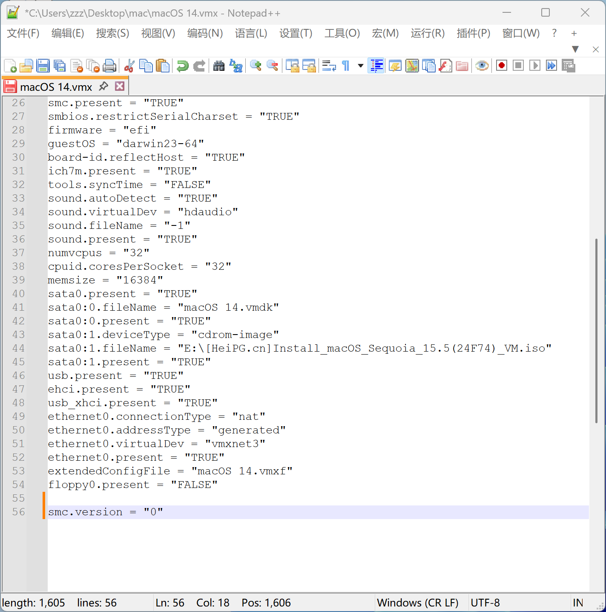

##### 方案2：在末尾加入的内容

```bash
board-id = "Mac-AA95B1DDAB278B95"
hw.model.reflectHost = "FALSE"
hw.model = "MacBookPro19,1"
serialNumber.reflectHost = "FALSE"
serialNumber = "C01231237890"
```

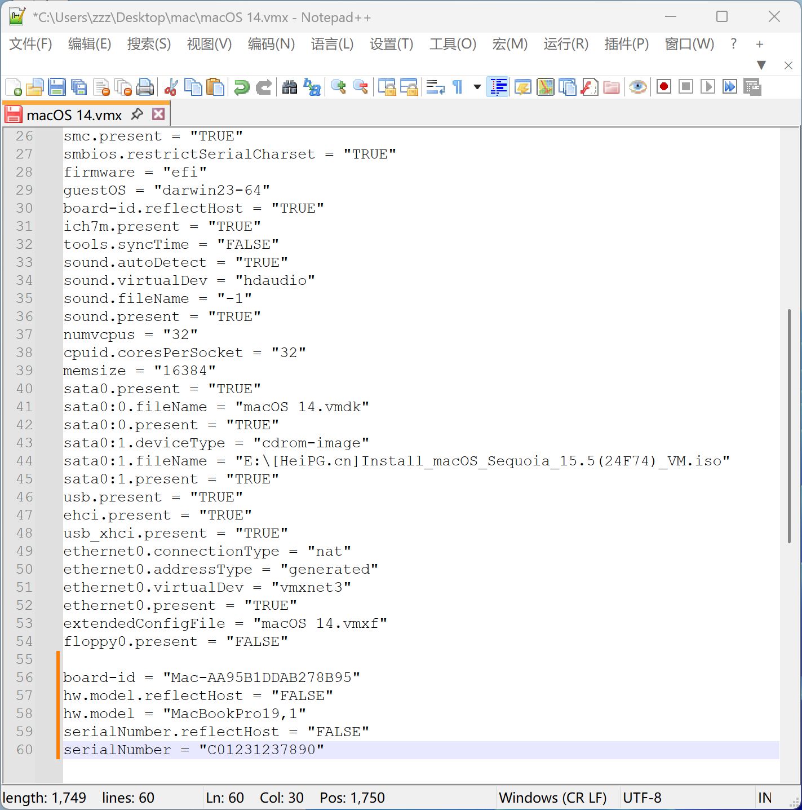

##### 方案3：修改以下两行内容

```bash
board-id.reflectHost = "FALSE"
ethernet0.virtualDev = "vmxnet3"
```

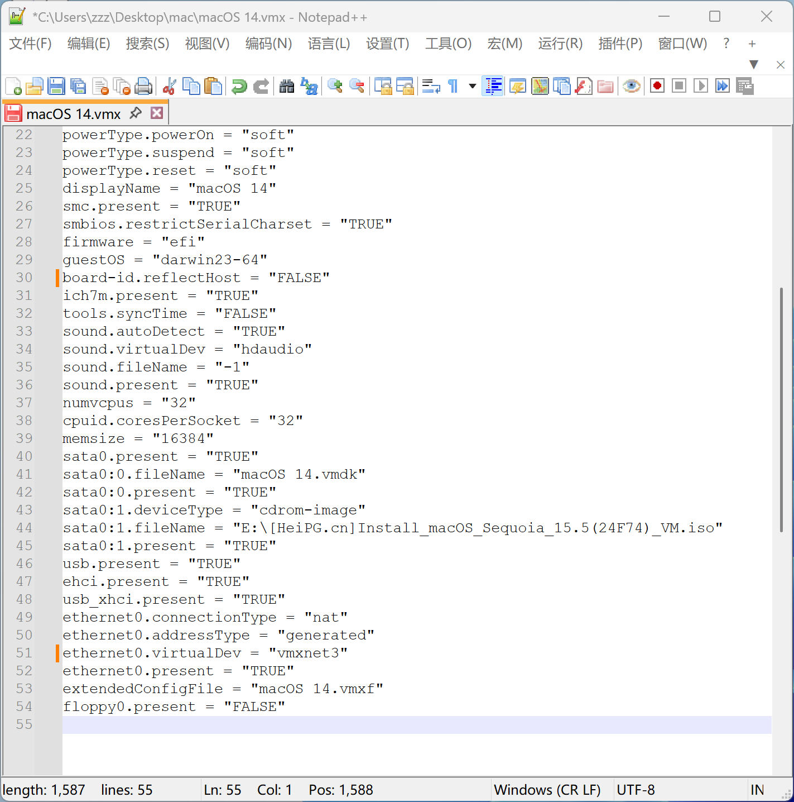


## 系统安装

#### 苹果logo


#### 简体中文


#### 磁盘工具


#### 选择以 `VMware` 开头的磁盘 `抹掉`


#### 自定义磁盘名称 `抹掉`


#### 安装macOS Sonoma


#### 继续


#### 选择磁盘 `继续`


#### 安装中 `大约30分钟，取决于电脑性能`


## 系统设置

#### 选择国家或地区 `中国大陆`


#### 语言与输入法 `继续`


#### 辅助功能 `以后`


#### 数据与隐私 `继续`


#### 迁移助理 `以后`


#### 通过Apple ID登录 `稍后设置`


#### 你确定要跳过使用Apple ID来登录吗？ `跳过`


#### 条款与条件 `同意`


#### 我已阅读并同意 `同意`


#### 创建电脑账户 `继续`


#### 启用定位服务 `关闭`


#### 你确定不想使用“定位服务”吗？ `不使用`


#### 选择你的时区 `北京市-中国大陆`


#### 分析 `关闭`


#### 屏幕使用时间 `稍后设置`


#### 选取你的外观 `继续`


#### 检查系统 `设置-通用` 


#### 桌面壁纸 `设置-墙纸-图片`


#### 若默认墙纸 `自然景观` 在 VMware 虚拟机无法正常显示，请切换为 `图片`


#### 网络连接测试


## 安装 VMware Tools

#### 在线安装


#### 使用ISO镜像文件安装
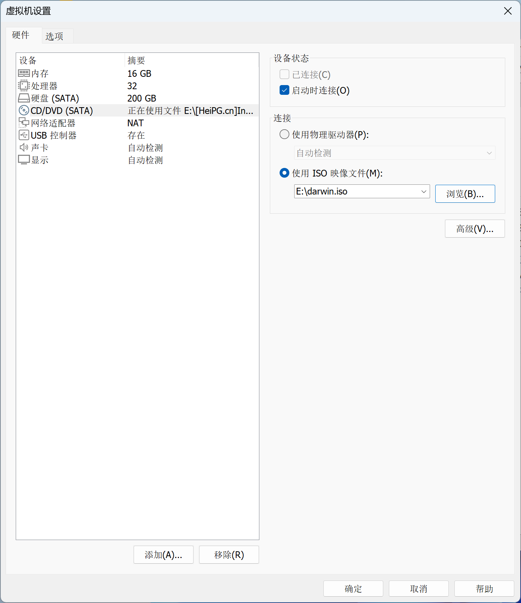

#### 安装 VMware Tools


#### 为这台电脑上的所有用户安装


#### 输入密码 `安装软件`


#### “安装器”想要管理你的电脑。管理可能包括修改密码、联网设置和系统设置。 `允许`


#### 系统拓展已被阻止 `好`


#### 输入密码 `修改设置`


#### 重新启动
